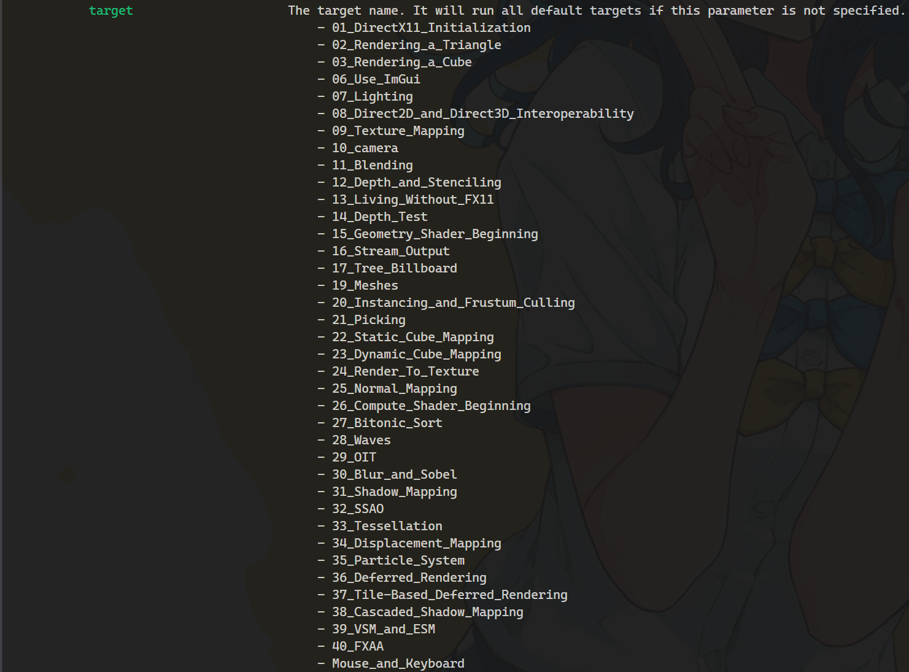

# DirectX11 With Windows SDK教程演示项目

 [](https://github.com/MKXJun/DirectX11-With-Windows-SDK/blob/master/MarkdownFiles/Updates/Updates.md)

**现代DX11系列教程：使用Windows SDK(C++)开发Direct3D 11.x**


>  **注意：**
>
>  - **2.x.x和1.x.x的主要区别在于19章之后的代码有大幅修改。**
>  - **若更新项目后渲染显示有问题，尝试删除Shaders/Cache文件夹**
>

## 博客教程

- [**Github在线版（优先保证最新）**](https://mkxjun.github.io/DirectX11-With-Windows-SDK-Book) 

- **[博客园](https://www.cnblogs.com/X-Jun/p/9028764.html)**

**CSDN目前停更**

## QQ群交流

**QQ群号：727623616**

欢迎大家来交流，以及项目有什么问题也可以在这里提出。

## CMake构建项目

### 命令行构建

在Win10系统下，若安装cmake的时候添加了环境变量，则可以直接运行`build_msvc.cmd`来生成项目并构建项目，完成后打开build文件夹可以找到解决方案，然后切换到Release x64就可以直接运行。

### GUI构建

使用`cmake-gui.exe`填写源码路径和构建路径，然后只需要关注下面一个变量：


- `WIN_SYSTEM_SUPPORT`：默认关闭，仅Win7用户需要勾选

然后就可以点`Generate`生成项目，生成的解决方案位于build文件夹内，或者点`Open Project`打开

## 打开教程项目

打开CMake生成的项目，建议切换成**Release x64**。若要指定运行哪个项目，需要对项目右键-设为启动项。然后就可以生成并运行了


> **注意：** 
> 1. **目前教程仅支持VS2017(或平台工具集v141)及更高版本，且必须使用Win10 SDK！**
> 2. **由于Assimp不支持Win32(x86)，本项目仅支持64位系统**
> 3. **Win7打开需要安装Service Pack 1以及KB2670838补丁**

## XMake构建项目（可选）

安装好xmake后，根据如下命令构建与编译项目

```
xmake f -p windows -a x64 -m debug/release
xmake 
xmake build [target]
xmake run [target]
```

`target`如下：



可以使用如下命令生成`compile_commands.json`(推荐)

```
xmake project -k compile_commands
```

或者使用如下命令生成vs2019/2022项目

```
xmake project -k [vsxmake2019|vsxmake2022]
```

项目代码库`assimp`目前使用`xrepo`进行包管理：

```
add_requires("assimp",{system = false })
```

## 项目概况

语言:</br>
- C++17</br>
- HLSL Shader Model 5.0

目前项目使用了下述代码库或文件：
- [ocornut/imgui](https://github.com/ocornut/imgui)：当前已经为这些项目使用ImGui：第7、10、15、16、17、20、23、30-39章。</br>
- [nothings/stb](https://github.com/nothings/stb)：使用其stb_image</br>
- [assimp/assimp](https://github.com/assimp/assimp)：模型加载</br>
- [DirectXTex/DDSTextureLoader](https://github.com/Microsoft/DirectXTex/tree/master/DDSTextureLoader)</br>
- [DirectXTex/WICTextureLoader](https://github.com/Microsoft/DirectXTex/tree/master/WICTextureLoader)</br>
- [DirectXTex/ScreenGrab](https://github.com/Microsoft/DirectXTex/tree/master/ScreenGrab)</br>
- [DirectXTK/Mouse(源码上有所修改)](https://github.com/Microsoft/DirectXTK/tree/master/Src)：不能和imgui同时使用</br>
- [DirectXTK/Keyboard(源码上有所修改)](https://github.com/Microsoft/DirectXTK/tree/master/Src)：不能和imgui同时使用</br>

作为教程演示项目，这里并不是以实现一个软引擎为目标。建议读者在跟随教程学习的同时要动手实践。

## 打包教程示例程序

以项目31的程序(Release x64)为例，其文件结构应为：

```cpp
Project 31
|----Model/                    (挑出项目用到的模型)
|----Texture/                  (挑出项目用到的纹理)
|----31 Shadow Mapping/        (此处命名自由发挥，比如bin)
     |----31 Shadow Mapping.exe
     |----imgui.ini
     |----assimp-vc14*-mt.dll  (从build/Assimp/bin/Release(或Debug)复制一份)
     |----Shaders/
```


## 支持/赞赏博主

**博客和项目维护不易，如果本系列教程对您有所帮助，希望能够扫码支持一下博主。**


## 使用Direct3D 11.x(Windows SDK)编写的魔方

**[点此查看](https://github.com/MKXJun/Rubik-Cube)**

## 最近更新

- 2024/7/20 Ver2.38.6
  - 修复Win7下Common项目的编译问题

**[历史更新记录](MarkdownFiles/Updates/Updates.md)**
